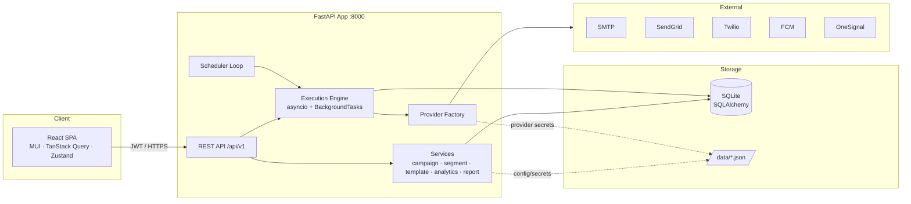
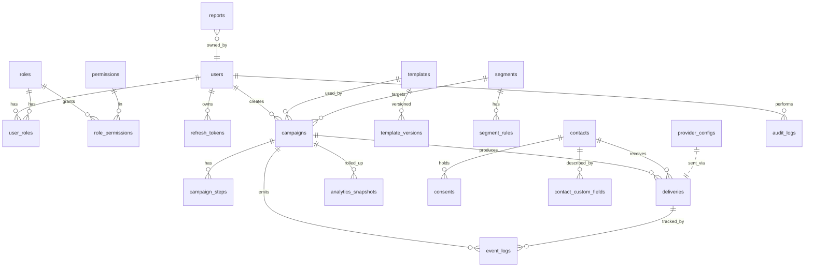
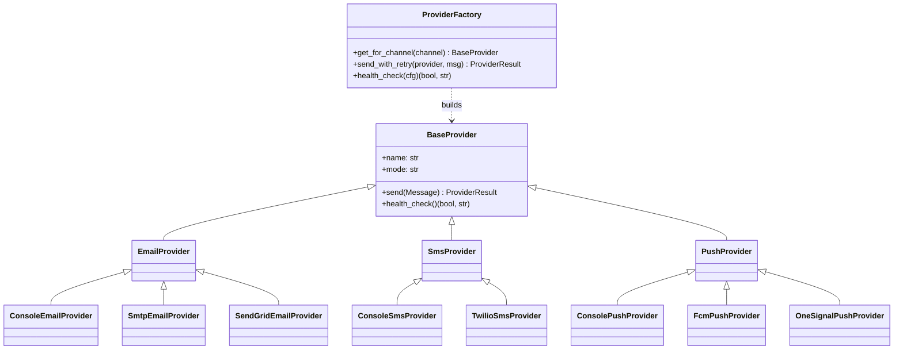
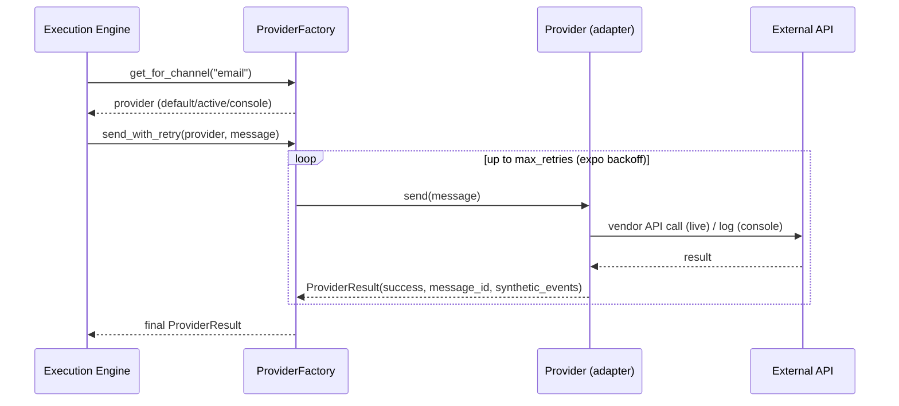
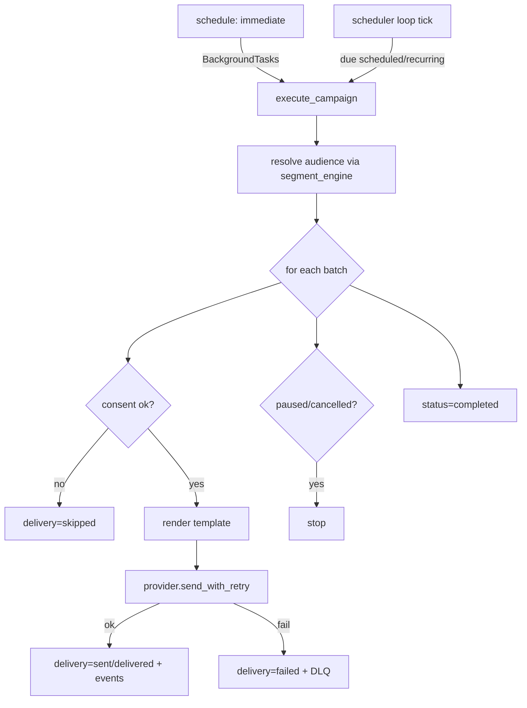
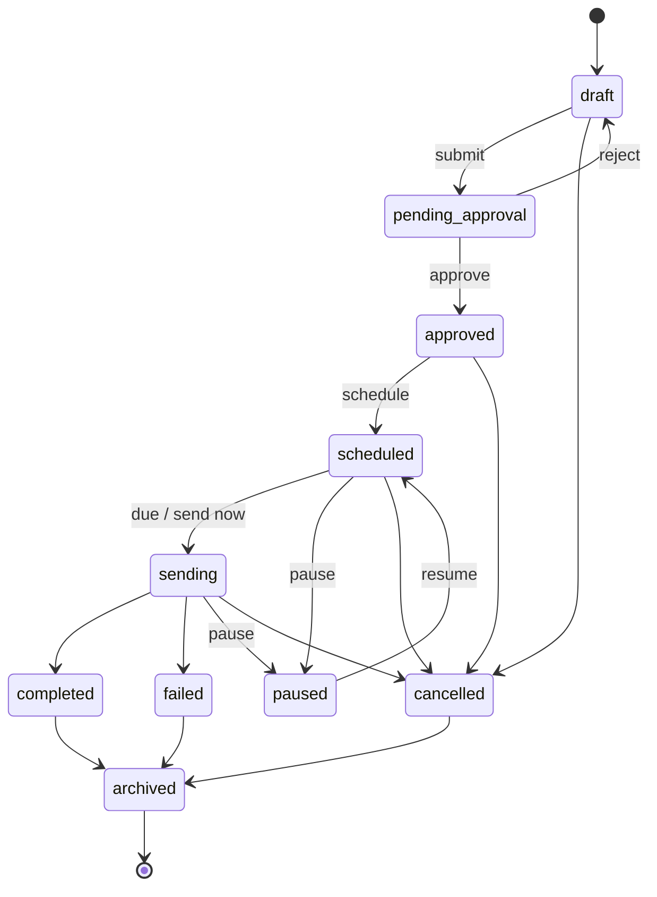
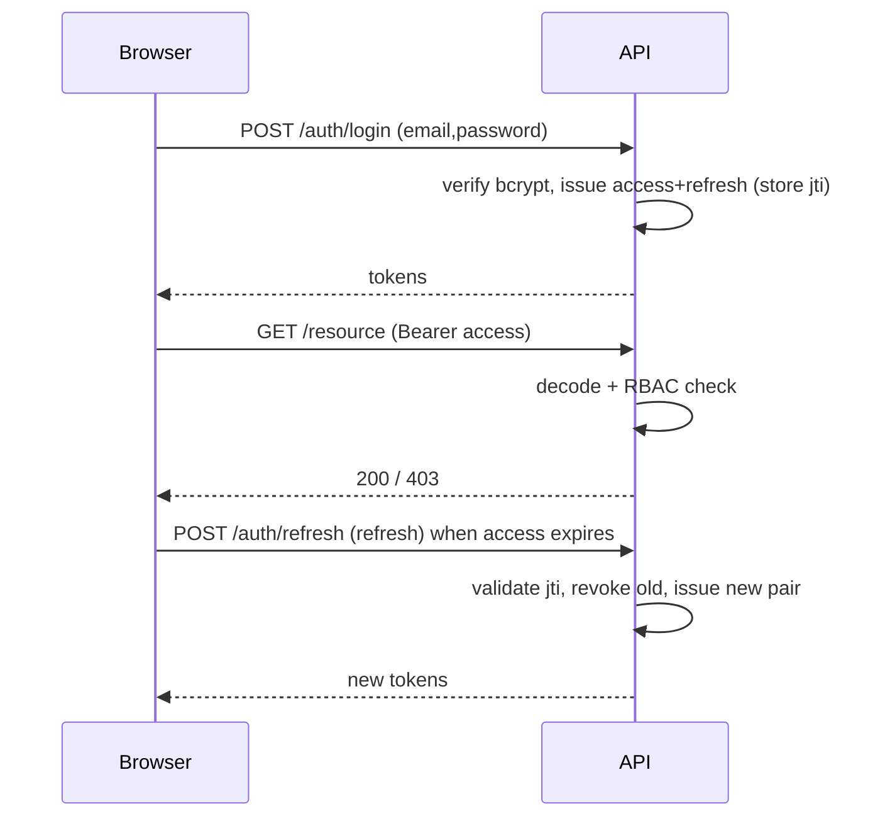
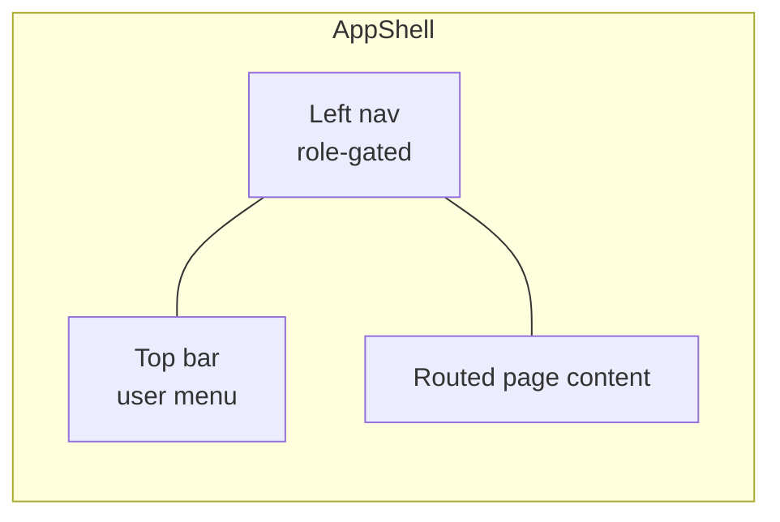

# Campaign Management Platform — Design Document

> Self-hosted Omnichannel Campaign Management Platform (Email / SMS / Push).
> Stack: FastAPI · SQLAlchemy · Alembic · Pydantic · SQLite · React · TypeScript · Vite · MUI.

**Contents**
1. [Product Vision](#1-product-vision)
2. [Functional Requirements](#2-functional-requirements)
3. [High-Level Architecture](#3-high-level-architecture)
4. [Low-Level Architecture](#4-low-level-architecture)
5. [Database Design](#5-database-design)
6. [JSON Storage Design](#6-json-storage-design)
7. [Backend Design](#7-backend-design)
8. [Frontend Design](#8-frontend-design)
9. [API Specifications](#9-api-specifications)
10. [Provider Integration Design](#10-provider-integration-design)
11. [Campaign Execution Design](#11-campaign-execution-design)
12. [Analytics Design](#12-analytics-design)
13. [Security Design](#13-security-design)
14. [UI/UX Specifications](#14-uiux-specifications)
15. [Deployment Design](#15-deployment-design)
16. [Testing Strategy](#16-testing-strategy)
17. [Implementation Roadmap](#17-implementation-roadmap)
18. [Release Plan](#18-release-plan)
19. [Risks & Mitigations](#19-risks--mitigations)

---

## 1. Product Vision

Marketing teams need to run coordinated Email/SMS/Push campaigns without depending on a
heavyweight SaaS. This platform is a **lightweight, modular, self-hosted** alternative
that a small team can deploy on a single host. It covers the full campaign lifecycle —
audience building, templating, approval, scheduling, execution, tracking, and reporting —
behind a clean RBAC model, with a pluggable provider framework so customers use their own
SMTP/SendGrid/Twilio/FCM/OneSignal accounts.

**Principles:** modular (clear module boundaries), maintainable (typed end-to-end), secure
(JWT + RBAC + audit), and deployment-ready (one command per tier, SQLite + JSON, no broker).

---

## 2. Functional Requirements

| # | Module | Requirement |
|---|--------|-------------|
| FR-1 | Auth | Login/logout, JWT access + rotating refresh tokens, password reset, profile, change password |
| FR-2 | RBAC | Admin / Marketer / Viewer roles enforced on every endpoint |
| FR-3 | Campaigns | One-time, recurring, drip, multi-channel; full lifecycle with approval workflow |
| FR-4 | Campaign ops | Create, edit, duplicate, pause, resume, archive, delete, calendar view |
| FR-5 | Templates | Email (subject/preheader/HTML), SMS (text + counter), Push (title/body/image/deep link/buttons); clone, search, categorize, version, preview, archive |
| FR-6 | Contacts | Manual entry, CSV bulk import, standard + custom fields, tags |
| FR-7 | Segmentation | Filter builder, dynamic + saved segments, live count preview |
| FR-8 | Consent | Email subscription, SMS STOP/START/HELP, push device consent; GDPR/TCPA/CAN-SPAM ready |
| FR-9 | Providers | Pluggable adapters, factory, health checks, retry, provider switching |
| FR-10 | Execution | Immediate + scheduled + timezone sends, batch processing, rate limiting, retry, DLQ |
| FR-11 | Tracking | Sent/delivered/opened/clicked/bounced/complaint/unsubscribe (email); sent/delivered/failed/replied (SMS); sent/delivered/opened/action (push) |
| FR-12 | Analytics | Campaign + channel metrics, rates, timeseries, dashboard |
| FR-13 | Reporting | CSV/Excel/PDF export, scheduled report definitions |
| FR-14 | Audit | User actions, campaign changes, provider config changes, logins |

---

## 3. High-Level Architecture



**Runtime topology (self-hosted):** one Uvicorn process serves the API and runs the
asyncio scheduler loop; SQLite (WAL mode) is the single datastore; the React app is built
to static files and served by any static host (or the Vite dev server in development).

---

## 4. Low-Level Architecture

```
backend/app/
├── core/         config, database, security (JWT/bcrypt), deps (RBAC), rate_limit, middleware, audit
├── models/       SQLAlchemy models + enums
├── schemas/      Pydantic request/response models
├── api/v1/       routers: auth, users, roles, templates, contacts, segments,
│                 campaigns, providers, analytics, reports, events, audit
├── services/     campaign_service (state machine), segment_engine, template_service,
│                 analytics_service, report_service
├── providers/    base (ABCs), console, smtp, sendgrid, twilio, fcm, factory
├── execution/    engine, scheduler, dlq
├── seed.py       idempotent seeder
└── main.py       app factory + lifespan (scheduler) + exception handlers
```

Request flow: `Router → deps (auth + RBAC) → service → ORM → DB`, with `audit` recording
mutations and `middleware` adding security headers + request logging. The execution engine
runs out-of-band via asyncio tasks using their own DB session.

---

## 5. Database Design

### ER Diagram



### Schema summary

Authoritative DDL is the generated Alembic migration in
`backend/alembic/versions/*_initial_schema.py`. Highlights:

| Table | Key columns | Notes / indexes |
|-------|-------------|-----------------|
| `users` | id, email (uniq), full_name, hashed_password, is_active, last_login_at | ix on email |
| `roles` / `permissions` | name/code (uniq) | seeded RBAC |
| `user_roles` / `role_permissions` | composite PK FKs | many-to-many |
| `refresh_tokens` | jti (uniq), user_id, expires_at, revoked | rotation + revocation |
| `campaigns` | type, status, channel, template_id, segment_id, scheduled_at, recurrence(JSON), next_run_at | ix (status, scheduled_at), ix next_run_at |
| `campaign_steps` | campaign_id, step_order, channel, template_id, delay_hours | drip / multi-channel |
| `templates` | channel, category, status, version, channel-specific content, variables(JSON) | ix (channel, status) |
| `template_versions` | template_id, version, snapshot(JSON) | immutable history |
| `contacts` | email, phone, device_token, names, country, timezone, tags(JSON), attributes(JSON), is_active | ix email/phone/country |
| `contact_custom_fields` | key (uniq), label, field_type | attribute schema |
| `consents` | contact_id, channel, status, source | uniq (contact, channel) |
| `segments` | name, definition(JSON rule tree), is_dynamic, cached_count | |
| `segment_rules` | segment_id, field, operator, value, group | normalized rules |
| `deliveries` | campaign_id, contact_id, channel, status, provider, provider_message_id, attempts, sent_at | ix (campaign, status), ix contact |
| `event_logs` | delivery_id, campaign_id, contact_id, channel, event_type, occurred_at | ix (campaign, type), ix occurred_at |
| `provider_configs` | name (uniq), channel, provider_type, config(JSON), mode, is_default, is_active, last_health_* | |
| `analytics_snapshots` | campaign_id, channel, snapshot_date, counters | uniq (campaign, channel, date) |
| `reports` | name, report_type, format, schedule, filters(JSON), last_generated_at | |
| `audit_logs` | user_id, action, entity_type, entity_id, detail(JSON), ip_address, created_at | ix (entity_type, entity_id) |

All tables carry `created_at` (+ `updated_at` where mutable). FK cascade deletes are
enabled (`PRAGMA foreign_keys=ON`).

---

## 6. JSON Storage Design

```
data/
├── config/      app.json, campaign.json, analytics.json, security.json
├── providers/   smtp.json, sendgrid.json, twilio.json, fcm.json, onesignal.json
├── metadata/    countries.json, timezones.json, campaign_types.json
└── sample-data/ contacts.json, templates.json, segments.json
```

- **config/** — operational, non-secret toggles (UI theme, batch sizes, password policy
  reference). Loaded + cached via `app.core.config.load_json_config`.
- **providers/** — provider secrets/settings overlaid onto the DB `provider_configs.config`
  at build time by the `ProviderFactory` (file values are defaults; DB overrides win).
- **metadata/** — lookup values for dropdowns (countries, timezones, campaign types).
- **sample-data/** — consumed by `app.seed` to bootstrap a demo environment.

Each file is plain JSON with a self-describing shape; see the files for live schemas.

---

## 7. Backend Design

- **Framework:** FastAPI with an app factory (`create_app`) and a lifespan context that
  creates tables (dev convenience), and starts/stops the scheduler.
- **ORM:** SQLAlchemy 2.0 declarative models; sessions via `get_db` dependency.
- **Validation:** Pydantic v2 schemas, channel-aware validators (e.g. email templates
  require subject + HTML).
- **AuthZ:** `require_roles(...)` dependency factory → `require_admin/marketer/viewer`.
- **Services** hold business logic and are framework-agnostic and unit-testable:
  - `campaign_service` — the lifecycle **state machine** (`ALLOWED` transition map).
  - `segment_engine` — compiles a JSON rule tree to SQLAlchemy filters.
  - `template_service` — safe `{{var}}` rendering (HTML-escaped), SMS segment counting.
  - `analytics_service` — aggregation from `event_logs` + `deliveries`.
  - `report_service` — CSV/Excel/PDF generation.
- **Audit:** `record_audit(...)` persists every mutation with actor, entity, IP.

---

## 8. Frontend Design

- **State:** server state via **TanStack Query** (`src/api/hooks.ts`); auth/session via
  **Zustand** (`src/store/auth.ts`).
- **HTTP:** Axios instance with JWT injection + transparent **refresh-on-401** rotation
  (`src/api/client.ts`).
- **Routing:** React Router with a `RequireAuth` guard; role-gated nav in `Layout`.
- **UI:** MUI components + `@mui/x-data-grid`; mobile-responsive theme; **Recharts** for
  analytics. Pages map 1:1 to spec (Login, Dashboard, Campaign List/Builder/Details/Calendar,
  Templates, Contacts, Segments, Analytics, Reports, Users, Providers, Audit).
- **Types:** `src/types.ts` mirrors backend Pydantic schemas for end-to-end typing.

---

## 9. API Specifications

Base path `/api/v1`. Auth via `Authorization: Bearer <access>`. Full interactive,
always-up-to-date OpenAPI is served at **`/docs`** (and `/openapi.json`).

| Module | Method & Path | Auth | Purpose |
|--------|---------------|------|---------|
| Auth | `POST /auth/login` | public | OAuth2 password → tokens |
| | `POST /auth/refresh` | public | Rotate refresh → new tokens |
| | `POST /auth/logout` | user | Revoke refresh token(s) |
| | `POST /auth/password-reset/request` | public | Issue reset token |
| | `POST /auth/password-reset/confirm` | public | Set new password |
| | `GET /auth/me` · `POST /auth/change-password` | user | Profile / password |
| Users | `GET/POST /users`, `GET/PATCH/DELETE /users/{id}` | admin | User mgmt |
| Roles | `GET /roles` | admin | List roles |
| Templates | `GET/POST /templates`, `GET/PATCH/DELETE /templates/{id}` | viewer/marketer | CRUD |
| | `POST /templates/{id}/clone\|archive\|preview` | marketer/viewer | Ops |
| Contacts | `GET/POST /contacts`, `GET/PATCH/DELETE /contacts/{id}` | viewer/marketer | CRUD |
| | `POST /contacts/import` | marketer | CSV bulk import |
| | `PUT /contacts/{id}/consent` | marketer | Consent update |
| | `GET/POST /contacts/custom-fields` | viewer/marketer | Custom fields |
| Segments | `GET/POST /segments`, `GET/PATCH/DELETE /segments/{id}` | viewer/marketer | CRUD |
| | `GET /segments/{id}/preview` · `POST /segments/preview` | viewer | Live count |
| Campaigns | `GET/POST /campaigns`, `GET/PATCH/DELETE /campaigns/{id}` | viewer/marketer | CRUD |
| | `GET /campaigns/calendar` | viewer | Calendar range |
| | `POST /campaigns/{id}/{submit\|approve\|schedule\|pause\|resume\|cancel\|archive\|duplicate}` | marketer | Lifecycle |
| | `GET /campaigns/{id}/deliveries\|events` | viewer | Delivery/event logs |
| Providers | `GET/POST /providers`, `PATCH/DELETE /providers/{id}` | admin | Config |
| | `POST /providers/{id}/health` | viewer | Health check |
| Analytics | `GET /analytics/overview\|timeseries\|campaigns/{id}` | viewer | Metrics |
| Reports | `GET /reports/export?fmt=csv\|excel\|pdf` | viewer | Export |
| | `GET/POST /reports`, `POST /reports/{id}/run` | marketer | Saved reports |
| Events | `GET /events/open/{id}.gif` · `GET /events/click/{id}` | public | Tracking |
| | `POST /events/ingest` · `POST /events/sms-keyword` | public | Webhooks (STOP/START/HELP) |
| Audit | `GET /audit-logs` | admin | Audit trail |

Every endpoint validates input with Pydantic (422 on failure), returns structured error
bodies (`{"detail": ...}`), and enforces RBAC (401 unauthenticated / 403 unauthorized).
State-machine violations return **409 Conflict**.

---

## 10. Provider Integration Design





- **Adapter pattern** isolates vendor SDKs behind `send`/`health_check`.
- **Factory** resolves provider by explicit id → channel default → first active → console
  fallback (the platform always has a working provider).
- **Retry** with exponential backoff; **switching** is a config change (`is_default`/`mode`).
- **Console** adapters log and emit synthetic `delivered/opened/clicked` events.

---

## 11. Campaign Execution Design



- **Lightweight processing** using FastAPI BackgroundTasks (immediate) + an asyncio
  scheduler loop (scheduled/recurring), no external broker.
- **Batching** (`EXECUTION_BATCH_SIZE`) with cooperative yields between batches.
- **Retry policy** in the factory; exhausted failures are **dead-lettered** to
  `data/dead_letter.jsonl`.
- **Timezone**: campaigns store `timezone` + `scheduled_at`; recurrence computes `next_run_at`.
- **Mid-flight control**: engine re-checks status each contact to honor pause/cancel.

### Campaign state machine



---

## 12. Analytics Design

- **Event-sourced**: `event_logs` is the source of truth; `deliveries` track send status.
- **On-the-fly aggregation** in `analytics_service` (`campaign_metrics`, `overview`,
  `timeseries`) with rates computed safely (no divide-by-zero).
- **Rollups**: `analytics_snapshots` (unique per campaign+channel+date) is the scale path —
  a daily job aggregates events so dashboards stay O(snapshots) not O(events) at 1M+ scale.
- **Rates**: open = opened/delivered, click = clicked/opened, delivery = delivered/sent,
  bounce = bounced/sent, reply = replied/sent (per channel as applicable).
- **Frontend**: Recharts area/line (timeseries), pie (funnel), bar (rates).

---

## 13. Security Design

| Control | Implementation |
|---------|----------------|
| Password hashing | bcrypt via passlib |
| Authentication | JWT access (30 min) + rotating refresh (7 d), `jti` persisted for revocation |
| Authorization | RBAC dependency on every route; least-privilege role grants |
| Input validation | Pydantic v2 on all request bodies/params |
| SQL injection | SQLAlchemy parameterized queries only (no string SQL) |
| XSS | Personalization values HTML-escaped during email render; React escapes by default; CSP header |
| Rate limiting | Sliding-window per-IP global + stricter login limiter |
| Secure headers | CSP, X-Frame-Options=DENY, nosniff, Referrer-Policy, Permissions-Policy |
| Audit logging | All mutations + logins recorded with actor + IP |
| Account safety | Generic password-reset response (no enumeration); self-delete blocked |

### RBAC matrix

| Capability | Admin | Marketer | Viewer |
|------------|:----:|:--------:|:------:|
| View campaigns/templates/contacts/segments/analytics | ✅ | ✅ | ✅ |
| Create/edit campaigns, templates, contacts, segments | ✅ | ✅ | ❌ |
| Approve / schedule / send campaigns | ✅ | ✅ | ❌ |
| Import contacts, manage consent | ✅ | ✅ | ❌ |
| Configure providers | ✅ | ❌ (read) | ❌ (read) |
| Manage users & roles | ✅ | ❌ | ❌ |
| View audit logs | ✅ | ❌ | ❌ |
| Export reports | ✅ | ✅ | ✅ |



---

## 14. UI/UX Specifications

Per page: **Layout / Components / Actions / Validation / Empty & Error states**. Example —
**Campaign Builder** (5-step stepper): Basics → Channel & Template → Audience → Schedule →
Review; inline validation (name required, channel-specific template list), empty state when
no templates exist (links to Templates), error banner on save failure.



```mermaid
flowchart TD
  subgraph CampaignBuilderWireframe
    H[New Campaign — Stepper]
    S[Step content card]
    F[Back | Next / Create]
    H --> S --> F
  end
```

All pages: responsive MUI grid, `Loading`/`EmptyState`/`ErrorState` shared components,
`ConfirmDialog` for destructive actions, `StatusChip` for lifecycle states.

---

## 15. Deployment Design

**Everything runs locally.** Two tiers:

- **Backend:** Uvicorn serves FastAPI; SQLite file `campaign.db` (WAL). Run migrations
  (`alembic upgrade head`) then seed. The asyncio scheduler runs in-process (toggle with
  `ENABLE_SCHEDULER`).
- **Frontend:** `npm run build` → static `dist/` served by any static server; dev uses Vite
  with a `/api` proxy.

Config via `.env` (secrets) + `data/config/*.json` (operational). For production: set a
strong `SECRET_KEY`, put Uvicorn behind a reverse proxy (TLS, HSTS), and run multiple
workers with the scheduler enabled on exactly one. (A `Dockerfile`/`docker-compose` per
tier is a natural next step — noted in the roadmap.)

---

## 16. Testing Strategy

| Layer | Coverage |
|-------|----------|
| Unit | password hashing, JWT, template rendering + XSS escaping, SMS segments, state machine, segment compiler |
| API / Integration | auth + refresh rotation, RBAC denial, template CRUD + preview, segment preview, **full campaign lifecycle** (draft→approve→send→deliveries), CSV import |
| Frontend | `tsc` typecheck + Vite production build (compile-time contract) |
| Security | RBAC tests, illegal-transition 409, auth failure paths; (add: rate-limit, injection fuzz) |
| UAT scenarios | (1) Marketer builds + sends a campaign, sees analytics. (2) Viewer is blocked from editing. (3) Admin configures a provider + health check. (4) STOP keyword unsubscribes a contact. |

Run: `cd backend && pytest` (16 tests pass) · `cd frontend && npm run build`.

---

## 17. Implementation Roadmap

| Phase | Scope | Status |
|-------|-------|--------|
| 0 | Repo scaffold, core (config/db/security), models, migration | ✅ Done |
| 1 | Auth + RBAC + users/roles | ✅ Done |
| 2 | Templates, contacts/consent, segments + engine | ✅ Done |
| 3 | Providers (adapters + factory), execution engine, events | ✅ Done |
| 4 | Analytics, reports, audit | ✅ Done |
| 5 | Full React UI (all pages) | ✅ Done |
| 6 | Docs + tests + E2E verification | ✅ Done |
| 7 | Hardening: real FCM/OneSignal live mode, scheduled-report cron, analytics rollup job | ⏳ Next |
| 8 | Scale: snapshot-backed analytics, streamed CSV import, queue-backed execution | ⏳ Next |
| 9 | Packaging: Dockerfiles, compose, CI | ⏳ Next |

---

## 18. Release Plan

- **v1.0 (MVP, this build):** all modules functional with console providers; SQLite; single host.
- **v1.1:** live FCM/OneSignal, scheduled reports, analytics rollup job, Dockerized deploy.
- **v1.2:** scale features (snapshot analytics, streamed import, optional Redis rate-limit/queue),
  observability (metrics/tracing), e2e UI tests (Playwright).
- **Versioning:** SemVer; DB changes ship as Alembic migrations; API under `/api/v1`.

---

## 19. Risks & Mitigations

| Risk | Impact | Mitigation |
|------|--------|------------|
| SQLite write concurrency at 500k msgs/day | Throughput ceiling | WAL + batching now; migrate to Postgres (SQLAlchemy makes this a URL change) for scale |
| In-process scheduler/execution on one host | No HA; lost on crash | DLQ for failures; v1.2 moves to a durable queue + worker |
| Live provider edge cases (bounces, async webhooks) | Inaccurate tracking | Adapter interface + `/events/ingest` webhook bridge; map vendor callbacks (TODO) |
| 1M contacts in one table | Query latency | Indexed columns + analytics snapshots; partition/streamed import in v1.2 |
| In-memory rate limiter not shared across workers | Weaker limit multi-worker | Pluggable; swap for Redis (same `hit` API) |
| Secrets in JSON/.env | Leakage | `.env` git-ignored; document secret manager for prod; rotate `SECRET_KEY` |
| Drip timing currently sends steps sequentially | Not true delayed drip | `delay_hours` modeled; scheduler-driven step execution is the next increment (TODO) |

---

*Generated as part of the initial implementation. The running code is the source of truth;
this document tracks intent and the path to production.*
